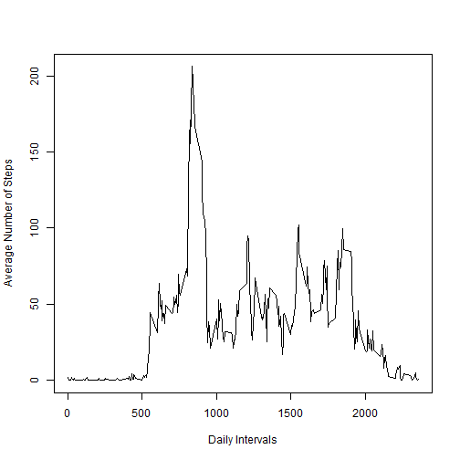

This is Project Assignment 1 for course "Reproducable Research"
==============================================================


```r
setwd("C:/Users/ESRAAD/Desktop/Reproducable Research/Week2/")
data <- read.csv(paste0("repdata_data_activity/activity.csv"))
```


```r
data$date <- as.Date(as.character(data$date), origin = "1899-12-30")
```


```r
library(stats)
Total_Steps <- aggregate(steps ~ date, data, FUN = "sum")
hist(Total_Steps$steps, xlab = "Steps taken per day", ylab = "Number of Days", main = "Total Number of seps taken by day")
```


```r
mean <- mean(Total_Steps$steps)
median <- median(Total_Steps$steps)
```
- Mean of the number of steps taken per day is 1.0766189 &times; 10<sup>4</sup>.
- Median of the number of steps taken per day is 10765.


```r
library(ggplot2)
Average_Steps <- aggregate(steps ~ interval, data, FUN = "mean")
with(Average_Steps, plot(interval, steps, type = "l", xlab = "Daily Intervals", ylab = "Average Number of Steps"))
```




```r
data1 <- data
Missing <- is.na(data1$steps)
NumberMissing <- sum(Missing)
m <- mean(data1$steps, na.rm = T)
data1$steps[Missing] <- m
head(data1)
```

```
##     steps       date interval
## 1 37.3826 2012-10-01        0
## 2 37.3826 2012-10-01        5
## 3 37.3826 2012-10-01       10
## 4 37.3826 2012-10-01       15
## 5 37.3826 2012-10-01       20
## 6 37.3826 2012-10-01       25
```

```r
Total_Steps1 <- aggregate(steps ~ date, data1, FUN = "sum")
hist(Total_Steps1$steps, xlab = "Steps taken per day", ylab = "Number of Days", main = "Total Number of seps taken by day")
```


```r
mean1 <- mean(Total_Steps1$steps)
median1 <- median(Total_Steps1$steps)
```
- Number of missing values is 2304 which will be replaced by the mean which is 37.3825996.
- Mean of the number of steps taken per day after imputing missing values is 1.0766189 &times; 10<sup>4</sup>.
- Median of the number of steps taken per day after imputing missing values is 1.0766189 &times; 10<sup>4</sup>.


```r
library(dplyr)
library(lattice)
data2 <- data1
data2$DayType <- factor(c("Weekday", "Weekend"))
Weekend <- c("Sunday", "Saturday")
data2$DayType <- ifelse(weekdays(data2$date) %in% Weekend, "Weekend", "Weekday")
Steps_DayType <- group_by(data2, interval, DayType)
Average_Steps_DayType <- summarize(Steps_DayType, mean = mean(steps))
xyplot(mean ~ interval | DayType, data = Average_Steps_DayType, layout = c(1,2), type = "l", xlab = "Daily Intervals", ylab = "Average Number of steps")
```


